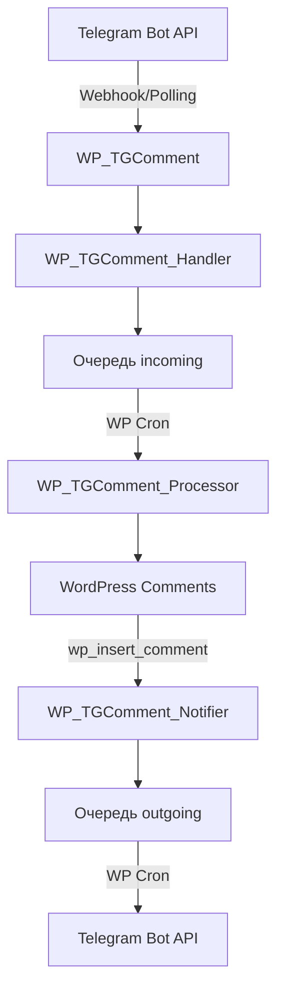

# WP TGComment

[](https://wordpress.org/)
[](https://php.net/)
[](https://www.gnu.org/licenses/gpl-2.0.html)

**Плагин WordPress для интеграции системы комментариев с Telegram Bot API**

WP TGComment — это мощный плагин, который превращает Telegram в полноценную платформу для общения между врачами и пациентами. Плагин автоматически синхронизирует сообщения между WordPress и Telegram, обеспечивая бесшовную коммуникацию.

## 🚀 Основные возможности

### 💬 Двусторонняя синхронизация сообщений
- **Telegram → WordPress**: Сообщения из Telegram автоматически становятся комментариями WordPress
- **WordPress → Telegram**: Новые комментарии мгновенно отправляются участникам консультации
- **Поддержка медиафайлов**: Фото, видео, документы, голосовые сообщения
- **Групповые медиа**: Обработка albums (несколько изображений в одном сообщении)

### 🔐 Безопасная авторизация
- **Telegram Login Widget**: Официальная авторизация через Telegram
- **Криптографическая проверка**: Полная валидация данных согласно документации Telegram
- **Автоматическая привязка**: Связывание аккаунтов WordPress и Telegram

### 🏥 Система консультаций
- **Доктор-Пациент**: Приватные консультации между двумя участниками
- **Множественные консультации**: Пациент может иметь несколько активных консультаций
- **Контекстные ответы**: Возможность отвечать на конкретные сообщения
- **Статус активности**: Управление активными/неактивными консультациями

### ⚡ Производительность и надежность
- **Асинхронная обработка**: Очередь сообщений с обработкой через WP Cron
- **Webhook и Polling**: Два режима получения обновлений от Telegram
- **Retry механизм**: Автоматические повторы при сбоях
- **Блокировки**: Предотвращение дублирования процессов

## 🛠 Архитектура

### Основные компоненты

| Класс | Назначение |
|-------|------------|
| `WP_TGComment` | Главный класс плагина, управление настройками и cron |
| `WP_TGComment_Handler` | Обработка входящих сообщений от Telegram |
| `WP_TGComment_Processor` | Преобразование сообщений в комментарии WordPress |
| `WP_TGComment_Notifier` | Отправка уведомлений в Telegram |
| `WP_TGComment_Auth` | Авторизация через Telegram Login Widget |

### Поток данных



## 📋 Требования

- **WordPress**: 5.0+
- **PHP**: 7.4+
- **Telegram Bot**: Токен от [@BotFather](https://t.me/botfather)
- **HTTPS**: Обязательно для Webhook режима
- **MySQL**: Для хранения очередей сообщений

## 🔧 Установка

### 1. Загрузка плагина

```bash
# Клонировать репозиторий
git clone https://github.com/mainpart/wp-tgcomment.git

# Или скачать как zip архив
wget https://github.com/mainpart/wp-tgcomment/archive/main.zip
```

### 2. Установка зависимостей

```bash
cd wp-tgcomment
composer install --no-dev --optimize-autoloader
```

### 3. Активация в WordPress

1. Загрузите папку плагина в `/wp-content/plugins/`
2. Активируйте плагин в админ-панели WordPress
3. Перейдите в **Настройки → WP TGComment**

### 4. Настройка Telegram бота

1. Создайте бота через [@BotFather](https://t.me/botfather)
2. Получите токен API
3. Введите токен в настройках плагина
4. Выберите режим получения обновлений (Webhook или Polling)

## ⚙️ Конфигурация

### Основные настройки

```php
// wp-config.php дополнительные константы
define('WP_TGCOMMENT_DEBUG', true); // Включить отладку
define('USER_META_KEY', 'tg_login_id'); // Ключ метаполя для Telegram ID
```

### Режимы работы

#### Webhook (рекомендуется)
- **Требования**: HTTPS, открытый порт 443/80
- **Преимущества**: Мгновенная доставка, меньше нагрузки на сервер
- **URL**: `https://yourdomain.com/wp-json/wp-tgcomment/v1/webhook/`

#### Polling (через WP Cron)
- **Требования**: Работающий WP Cron
- **Интервал**: Каждые 2 минуты
- **Преимущества**: Работает без HTTPS

### Cron задачи

| Задача | Интервал | Назначение |
|--------|----------|------------|
| `wp_tgcomment_get_updates` | 2 мин | Получение обновлений (только Polling) |
| `wp_tgcomment_process_comments` | 1 мин | Обработка входящих сообщений |
| `wp_tgcomment_send_notifications` | 1 мин | Отправка исходящих уведомлений |

## 📊 База данных

### Таблицы

#### wp_tgcomments_incoming
Очередь входящих сообщений от Telegram
```sql
CREATE TABLE wp_tgcomments_incoming (
  id bigint(20) NOT NULL AUTO_INCREMENT,
  wp_user_id bigint(20) NOT NULL,
  telegram_user_id bigint(20) NOT NULL,
  chat_id bigint(20) NOT NULL,
  tg_message_id bigint(20) NOT NULL,
  post_id bigint(20) NOT NULL,
  telegram_message_json longtext NOT NULL,
  media_group_id varchar(50) DEFAULT NULL,
  created_at datetime DEFAULT CURRENT_TIMESTAMP,
  retry_count int(11) DEFAULT 0,
  is_deleted tinyint(1) DEFAULT 0,
  PRIMARY KEY (id),
  UNIQUE KEY unique_message (chat_id, tg_message_id)
);
```

#### wp_tgcomments_outgoing
Очередь исходящих уведомлений в Telegram
```sql
CREATE TABLE wp_tgcomments_outgoing (
  id bigint(20) NOT NULL AUTO_INCREMENT,
  comment_id bigint(20) NOT NULL,
  recipient_user_id bigint(20) NOT NULL,
  telegram_user_id bigint(20) NOT NULL,
  chat_id bigint(20) NOT NULL,
  message_text longtext NOT NULL,
  attachment_urls longtext,
  created_at datetime DEFAULT CURRENT_TIMESTAMP,
  sent_at datetime DEFAULT NULL,
  retry_count int(11) DEFAULT 0,
  status enum('pending','sent','failed') DEFAULT 'pending',
  PRIMARY KEY (id)
);
```

### Метаполя комментариев

- `tg_incoming_message_id` - ID сообщения в Telegram (для входящих)
- `tg_outgoing_message_id` - ID сообщения в Telegram (для исходящих)
- `tg_incoming_chat_id` - ID чата (для входящих)
- `tg_outgoing_chat_id` - ID чата (для исходящих)
- `attachment_id` - ID вложений WordPress

## 🎯 Использование

### Команды Telegram бота

| Команда | Описание |
|---------|----------|
| `/start` | Показать доступные консультации |
| `/list` | Последние 3 сообщения из активной консультации |
| `/logout` | Отключить аккаунт от Telegram |

### Workflow для пользователя

1. **Авторизация**: Пользователь отправляет любое сообщение боту
2. **Login Widget**: Бот предлагает авторизоваться через Telegram
3. **Выбор консультации**: После авторизации выбирается активная консультация
4. **Общение**: Все сообщения автоматически синхронизируются

### API для разработчиков

```php
// Отправить сообщение в Telegram
$message_id = WP_TGComment_Handler::send_message(
    $chat_id, 
    'Текст сообщения', 
    $keyboard, 
    $comment_id
);

// Найти пользователя по Telegram ID
$wp_user = WP_TGComment_Handler::find_wp_user_by_telegram_id($telegram_id);

// Сохранить входящее сообщение
$id = WP_TGComment_Handler::save_incoming_message(
    $wp_user_id, 
    $telegram_user_id, 
    $post_id, 
    $message_data
);
```

## 🔍 Мониторинг и отладка

### Логи

```bash
# Логи PHP (в Docker Devilbox)
tail -f ~/devilbox/log/php-fpm-8.1/php-fpm.error

# Логи Docker контейнера
docker-compose logs php
```

### WP CLI команды

```bash
# Проверить статус cron задач
wp cron event list --user=admin

# Запустить обработку сообщений вручную
wp cron event run wp_tgcomment_process_comments --user=admin

# Получить информацию о записи
wp post get 4294 --user=admin

# Проверить метаполя пользователя
wp user meta list 1 --user=admin
```

### Тестирование

```bash
# Эмуляция входящего сообщения
wp db query "INSERT INTO wp_tgcomments_incoming (...) VALUES (...)" --user=admin

# Использование example.json для тестов
cat example.json | wp eval 'WP_TGComment_Handler::process_message(json_decode(file_get_contents("php://stdin"), true));' --user=admin
```

## 🤝 Участие в разработке

### Требования для разработки

- PHP 7.4+
- Composer
- WordPress тестовое окружение
- Docker (опционально, для Devilbox)

### Локальная разработка

```bash
# Клонировать репозиторий
git clone https://github.com/mainpart/wp-tgcomment.git
cd wp-tgcomment

# Установить зависимости
composer install

# Запустить тесты (когда будут добавлены)
composer test
```

### Структура проекта

```
wp-tgcomment/
├── class.wp-tgcomment.php           # Главный класс
├── class.wp-tgcomment-handler.php   # Обработчик сообщений
├── class.wp-tgcomment-processor.php # Процессор в комментарии
├── class.wp-tgcomment-notifier.php  # Уведомления
├── class.wp-tgcomment-auth.php      # Авторизация
├── settings.php                     # Настройки админки
├── wp-tgcomment.php                # Bootstrap файл
├── composer.json                    # Зависимости
├── example.json                     # Пример сообщения
└── README.md                        # Документация
```

## 📄 Лицензия

Этот проект распространяется под лицензией GPLv2 или более поздней версии. См. файл [LICENSE](LICENSE) для подробностей.

## 👨‍💻 Автор

**Дмитрий Красников**
- Email: dmitry.krasnikov@gmail.com
- GitHub: [@mainpart](https://github.com/mainpart)

## 🙏 Благодарности

- [Telegram Bot API](https://core.telegram.org/bots/api) за отличную документацию
- [WordPress](https://wordpress.org/) за платформу
- [WP Dependency Installer](https://github.com/afragen/wp-dependency-installer) за управление зависимостями

## 📈 Статистика


---

**Нужна помощь?** [Создайте issue](https://github.com/mainpart/wp-tgcomment/issues/new) или свяжитесь с автором. 