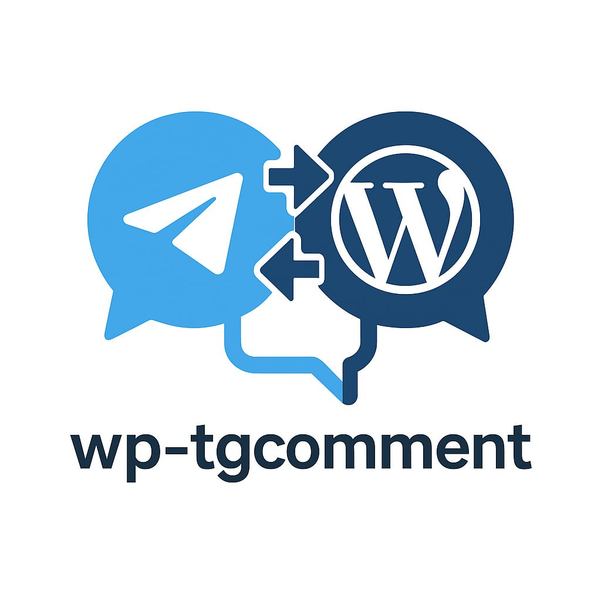
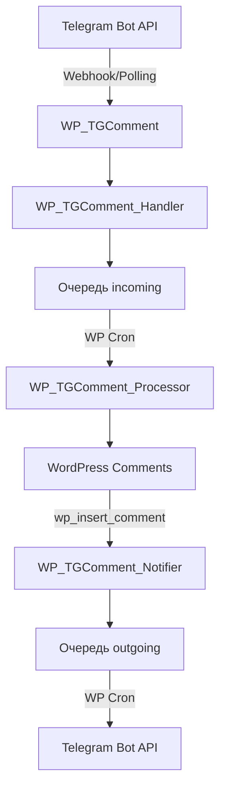

# WP TGComment

[](https://wordpress.org/)
[](https://php.net/)
[](https://www.gnu.org/licenses/gpl-2.0.html)



**Плагин WordPress для интеграции системы комментариев с Telegram Bot API**

WP TGComment — это специализированный плагин для WordPress, который обеспечивает интеграцию комментариев WP с Telegram Bot API. Плагин создает платформу для двустороннего общения между консультантом и пользователями через Telegram, автоматически синхронизируя все сообщения с комментариями WordPress.

Консультации организуются на основе специального типа записей `consultation`, который регистрируется дополнительным плагином [Pharma](https://github.com/mainpart/pharma). Каждая консультация строго привязана к двум участникам, идентификаторы которых обязательно указываются в метаполях записи как `doctor_id` и `client_id`. Каждая консультация это переписка исключительно двух участников, преимущественно рассматриваемая как консультация между доктором и пациентом, однако сценарии применения системы могут быть шире.

<br clear="left">

## 🚀 Основные возможности

### 💬 Двусторонняя синхронизация сообщений
- **Telegram → WordPress**: Сообщения из Telegram автоматически становятся комментариями WordPress
- **WordPress → Telegram**: Новые комментарии мгновенно отправляются участникам консультации
- **Поддержка медиафайлов**: Фото, видео, документы, голосовые сообщения
- **Групповые медиа**: Обработка albums (несколько изображений в одном сообщении)

### 🔐 Безопасная авторизация
- **Telegram Login Widget**: Официальная авторизация через Telegram
- **Криптографическая проверка**: Полная валидация данных согласно документации Telegram
- **Автоматическая привязка**: Связывание аккаунтов WordPress и Telegram

### 🏥 Система консультаций
- **Доктор-Пациент**: Приватные консультации между двумя участниками
- **Множественные консультации**: 
  - Врач ведет одновременно множество консультаций с различными пациентами
  - Пациент может иметь несколько активных консультаций (например, на родственников)
- **Дифференцированные режимы ответов**:
  - **Врач**: Обязательно отвечает через reply на конкретные сообщения (предотвращает ошибки при множественных консультациях)
  - **Пациент**: Может писать прямые сообщения или выбирать активную консультацию
- **Контекстные ответы**: Возможность отвечать на конкретные сообщения через swipe/reply

### ⚡ Производительность и надежность
- **Асинхронная обработка**: Очередь сообщений с обработкой через WP Cron
- **Webhook и Polling**: Два режима получения обновлений от Telegram
- **Retry механизм**: Автоматические повторы при сбоях

## 🛠 Архитектура

### Основные компоненты

| Класс | Назначение |
|-------|------------|
| `WP_TGComment` | Главный класс плагина, управление настройками и cron |
| `WP_TGComment_Handler` | Обработка входящих сообщений от Telegram |
| `WP_TGComment_Processor` | Преобразование сообщений в комментарии WordPress |
| `WP_TGComment_Notifier` | Отправка уведомлений в Telegram |
| `WP_TGComment_Auth` | Авторизация через Telegram Login Widget |

### Поток данных



## 📦 Зависимости

Плагин требует установки следующих зависимых плагинов, которые указаны в `wp-dependencies.json`:

| Плагин | Назначение | Репозиторий |
|--------|------------|-------------|
| **Codestar Framework** | Фреймворк для создания настроек админ-панели | [mainpart/codestar-framework](https://github.com/mainpart/codestar-framework) |
| **Git Updater** | Автоматическое обновление плагинов из GitHub | [afragen/git-updater](https://github.com/afragen/git-updater) |
| **Pharma** | Основной плагин с типом записей `consultation` | [mainpart/pharma](https://github.com/mainpart/pharma) |
| **DCO Comment Attachment** | Поддержка вложений в комментариях | [yadenis/DCO-Comment-Attachment](https://github.com/yadenis/DCO-Comment-Attachment) |

> **Важно**: Плагин Pharma регистрирует критически важный тип записей `consultation` и предоставляет базовую функциональность для медицинских консультаций. Без него WP TGComment не сможет функционировать корректно.

## 🔧 Установка

### 1. Загрузка плагина

```bash
# Клонировать репозиторий
git clone https://github.com/mainpart/wp-tgcomment.git

# Или скачать как zip архив
wget https://github.com/mainpart/wp-tgcomment/archive/main.zip
```

### 2. Установка зависимостей

```bash
cd wp-tgcomment
composer install --no-dev --optimize-autoloader
```

### 3. Активация в WordPress

1. Загрузите папку плагина в `/wp-content/plugins/`
2. Активируйте плагин в админ-панели WordPress
3. Перейдите в **Настройки → WP TGComment**

### 4. Настройка Telegram бота

1. Создайте бота через [@BotFather](https://t.me/botfather)
2. Получите токен API
3. Введите токен в настройках плагина
4. Выберите режим получения обновлений (Webhook или Polling)

## ⚙️ Конфигурация

### Основные настройки

```php
// wp-config.php дополнительные константы
define('WP_TGCOMMENT_DEBUG', true); // Включить отладку
```

### Cron задачи

| Задача | Интервал | Назначение |
|--------|----------|------------|
| `wp_tgcomment_get_updates` | 2 мин | Получение обновлений (только Polling) |
| `wp_tgcomment_process_comments` | 1 мин | Обработка входящих сообщений |
| `wp_tgcomment_send_notifications` | 1 мин | Отправка исходящих уведомлений |

## 📊 База данных

### Таблицы

#### wp_tgcomments_incoming
Очередь входящих сообщений от Telegram
```sql
CREATE TABLE wp_tgcomments_incoming (
  id bigint(20) NOT NULL AUTO_INCREMENT,
  wp_user_id bigint(20) NOT NULL,
  telegram_user_id bigint(20) NOT NULL,
  chat_id bigint(20) NOT NULL,
  tg_message_id bigint(20) NOT NULL,
  post_id bigint(20) NOT NULL,
  telegram_message_json longtext NOT NULL,
  media_group_id varchar(50) DEFAULT NULL,
  created_at datetime DEFAULT CURRENT_TIMESTAMP,
  retry_count int(11) DEFAULT 0,
  is_deleted tinyint(1) DEFAULT 0,
  PRIMARY KEY (id),
  UNIQUE KEY unique_message (chat_id, tg_message_id)
);
```

#### wp_tgcomments_outgoing
Очередь исходящих уведомлений в Telegram
```sql
CREATE TABLE wp_tgcomments_outgoing (
  id bigint(20) NOT NULL AUTO_INCREMENT,
  comment_id bigint(20) NOT NULL,
  recipient_user_id bigint(20) NOT NULL,
  telegram_user_id bigint(20) NOT NULL,
  chat_id bigint(20) NOT NULL,
  message_text longtext NOT NULL,
  attachment_urls longtext,
  created_at datetime DEFAULT CURRENT_TIMESTAMP,
  sent_at datetime DEFAULT NULL,
  retry_count int(11) DEFAULT 0,
  status enum('pending','sent','failed') DEFAULT 'pending',
  PRIMARY KEY (id)
);
```

### Метаполя

#### Метаполя записей консультаций
- `doctor_id` - **[ОБЯЗАТЕЛЬНО]** ID врача (wp_user.ID)
- `client_id` - **[ОБЯЗАТЕЛЬНО]** ID пациента (wp_user.ID)

> **Критически важно**: Метаполя `doctor_id` и `client_id` должны быть заполнены для каждой записи типа `consultation`. Плагин использует эти данные для определения участников консультации и маршрутизации сообщений.

#### Метаполя комментариев
- `tg_incoming_message_id` - ID сообщения в Telegram (для входящих)
- `tg_outgoing_message_id` - ID сообщения в Telegram (для исходящих)
- `tg_incoming_chat_id` - ID чата (для входящих)
- `tg_outgoing_chat_id` - ID чата (для исходящих)
- `attachment_id` - ID вложений WordPress

#### Метаполя пользователей
- `telegram_id` - ID пользователя в Telegram для связи аккаунтов

## 🎯 Использование

### Команды Telegram бота

| Команда | Описание |
|---------|----------|
| `/start` | Показать доступные консультации |
| `/list` | Последние 3 сообщения из активной консультации |
| `/logout` | Отключить аккаунт от Telegram |

### Workflow для пациента

1. **Авторизация**: Пользователь отправляет любое сообщение боту
2. **Login Widget**: Бот предлагает авторизоваться через Telegram
3. **Выбор консультации**: После авторизации выбирается активная консультация
4. **Общение**: Все сообщения автоматически синхронизируются

### Workflow для врача

1. **Авторизация**: Врач инициирует общение с ботом
2. **Автоматическое определение роли**: Система определяет роль пользователя по базе данных
3. **Получение уведомлений**: 
   - Все входящие сообщения от пациентов поступают в общий поток
   - Каждое сообщение содержит контекст консультации
4. **Обязательный режим ответов**: 
   - Врач может отвечать ТОЛЬКО через reply на конкретные сообщения
   - Прямая отправка сообщений без контекста запрещена
   - Это предотвращает ошибочную отправку сообщений не тому пациенту
5. **Управление консультациями**: 
   - Возможность просмотра списка активных консультаций
   - Быстрый доступ к истории сообщений каждой консультации
  
## 🤝 Участие в разработке

### Требования для разработки

- PHP 7.4+
- Composer
- WordPress тестовое окружение
- Docker (опционально, для Devilbox)

### Локальная разработка

```bash
# Клонировать репозиторий
git clone https://github.com/mainpart/wp-tgcomment.git
cd wp-tgcomment

# Установить зависимости
composer install

# Запустить тесты (когда будут добавлены)
composer test
```

### Структура проекта

```
wp-tgcomment/
├── class.wp-tgcomment.php           # Главный класс
├── class.wp-tgcomment-handler.php   # Обработчик сообщений
├── class.wp-tgcomment-processor.php # Процессор в комментарии
├── class.wp-tgcomment-notifier.php  # Уведомления
├── class.wp-tgcomment-auth.php      # Авторизация
├── settings.php                     # Настройки админки
├── wp-tgcomment.php                # Bootstrap файл
├── composer.json                    # Зависимости
├── example.json                     # Пример сообщения
└── README.md                        # Документация
```

## 📄 Лицензия

Этот проект распространяется под лицензией GPLv2 или более поздней версии. См. файл [LICENSE](LICENSE) для подробностей.

## 👨‍💻 Автор

**Дмитрий Красников**
- Email: dmitry.krasnikov@gmail.com
- GitHub: [@mainpart](https://github.com/mainpart)

## 🙏 Благодарности

- [Telegram Bot API](https://core.telegram.org/bots/api) за отличную документацию
- [WordPress](https://wordpress.org/) за платформу
- [WP Dependency Installer](https://github.com/afragen/wp-dependency-installer) за управление зависимостями

## 📈 Статистика


---

**Нужна помощь?** [Создайте issue](https://github.com/mainpart/wp-tgcomment/issues/new) или свяжитесь с автором. 
